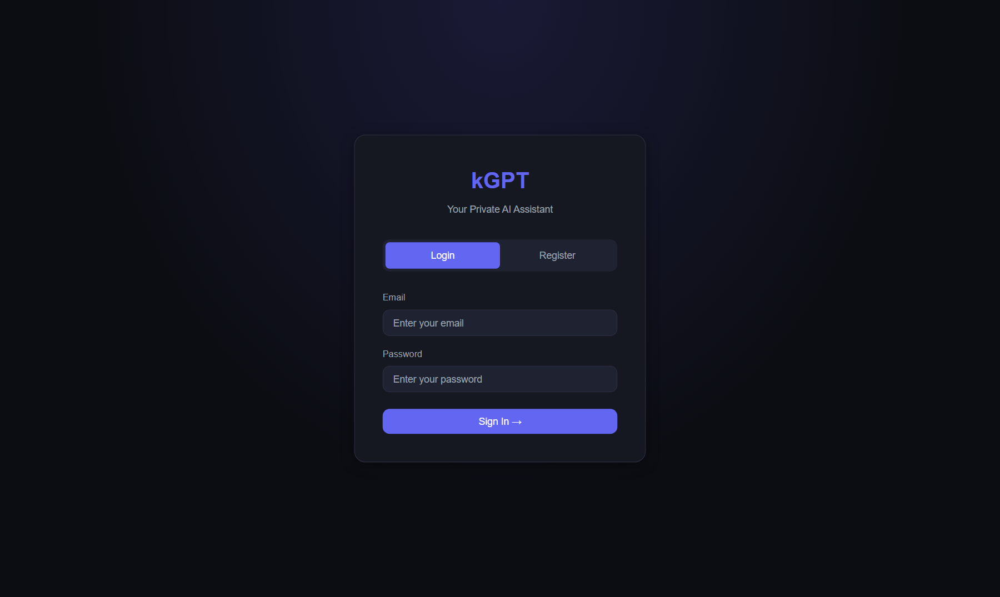
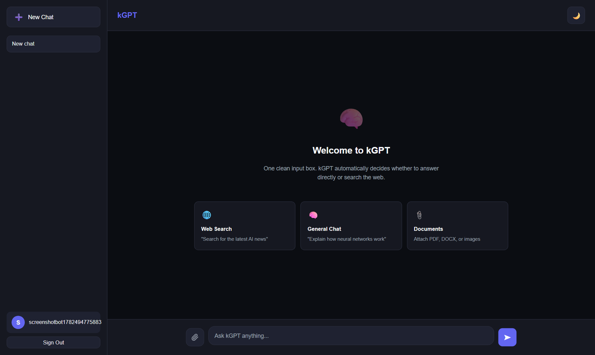
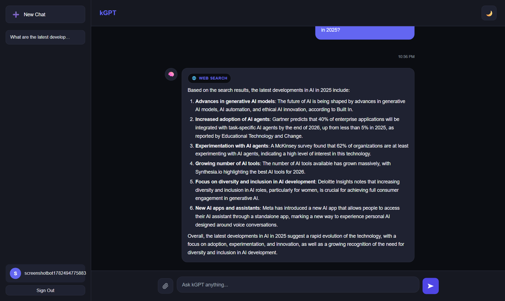
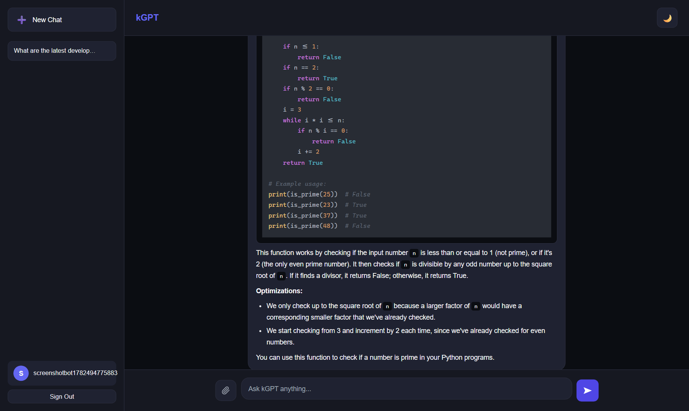
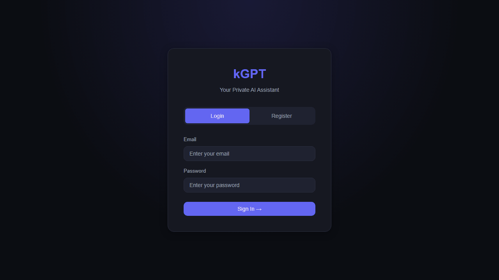

<p align="center">
  <h1 align="center">kGPT</h1>
  <p align="center"><strong>Your Private AI Assistant</strong></p>
  <p align="center">
    A full-stack AI chat application with intelligent web-search routing, file understanding,
    streaming responses, and per-user conversation management — designed and implemented from scratch with FastAPI and vanilla JS.
  </p>
  <p align="center">
    <a href="https://kgpt.zrik.tech">
      
    </a>
  </p>
  <p align="center">
    
    
    
    
    
    
  </p>
</p>

---

<table>
  <tr>
    <td></td>
    <td></td>
  </tr>
  <tr>
    <td align="center"><em>Clean login & register</em></td>
    <td align="center"><em>Home with suggestion cards</em></td>
  </tr>
  <tr>
    <td></td>
    <td></td>
  </tr>
  <tr>
    <td align="center"><em>Intelligent web search — auto-routed</em></td>
    <td align="center"><em>Syntax-highlighted code rendering</em></td>
  </tr>
</table>

---

## Why I Built This

kGPT was built to explore production-ready AI application development end-to-end. The project focuses on intelligent LLM response streaming, automatic web-search routing, multi-file document understanding, secure authentication, and cloud deployment — rather than relying on pre-built chatbot frameworks. Every layer, from the SSE streaming protocol to the idempotent database migrations, was designed and implemented from scratch.

---

## Features

| # | Feature | Description |
|---|---------|-------------|
| 1 | **Intelligent routing** | Every message is classified by the LLM as `general` (direct answer) or `web` (live search + summarise). No mode switching needed. |
| 2 | **Streaming responses** | Token-by-token streaming over Server-Sent Events with a stop button to cancel mid-generation. |
| 3 | **Real-time web search** | Live DuckDuckGo results fetched and summarised by the LLM when needed. |
| 4 | **File understanding** | Attach up to 10 files per conversation (PDF, DOCX, JPG, PNG). Text extracted via PyMuPDF/python-docx; images described by a vision model. Context injected into every subsequent message. |
| 5 | **Conversation management** | Create, switch, rename, and delete chats. Session persists across page refreshes; fresh chat on login. |
| 6 | **Rich message rendering** | Markdown, syntax-highlighted code blocks with copy buttons, LaTeX math (KaTeX). |
| 7 | **Message actions** | Copy, edit & resend, regenerate last reply. |
| 8 | **Auth & security** | JWT + Argon2 password hashing. JWT secret validated at startup. WAL-mode SQLite. |
| 9 | **Rate limiting** | 20 messages/min + 1000 messages/week per user — protects the upstream API. |
| 10 | **HTTPS** | Nginx reverse proxy with a Let's Encrypt certificate (auto-renewing). |

---

## Demo

<!-- Replace this section with a GIF once recorded.
     Recommended flow: login → ask a general question → ask something that triggers web search → upload a PDF → ask about it.
     Tools: ScreenToGif (Windows), Kap (macOS), peek (Linux).
     Example:
     
-->

Try it live at **[kgpt.zrik.tech](https://kgpt.zrik.tech)**

---

## Tech Stack

| Layer | Technology |
|-------|------------|
| **Backend** | FastAPI, Python 3.11+ |
| **LLM** | Groq API — `llama-3.3-70b-versatile` (chat) + `llama-4-scout-17b-16e-instruct` (vision) |
| **LLM framework** | LangChain 0.3.x |
| **Database** | SQLite + SQLAlchemy (WAL mode) |
| **Authentication** | JWT (PyJWT) + Argon2 (pwdlib) |
| **Web search** | DuckDuckGo via `ddgs` |
| **File extraction** | PyMuPDF (PDF), python-docx (DOCX), Groq vision (images) |
| **Email** | Gmail SMTP (verification emails) |
| **Frontend** | Vanilla HTML / CSS / JS — no build step |
| **Frontend libs** | marked + DOMPurify, highlight.js, KaTeX |
| **Reverse proxy** | Nginx + Let's Encrypt |
| **Deployment** | AWS EC2 (Ubuntu), systemd |
| **Containerisation** | Docker + Docker Compose |

---

## Architecture

```
Browser
  │
  ├─ GET /           → FastAPI serves frontend/index.html (static)
  │
  └─ POST /api/chat/stream
       │
       ├─ Auth: JWT verified
       ├─ Rate limit: 20/min + 1000/week (in-memory bucket + DB count)
       ├─ File context: all attachments prepended to prompt
       ├─ Router: LLM classifies → general or web
       │     ├─ general: LLM answers directly
       │     └─ web: DuckDuckGo → results → LLM summarises
       └─ SSE stream: meta → chunk... → done
```

**Request flow:**
1. Frontend sends `POST /api/chat/stream` with `{message, conversation_id}`
2. Rate limits checked (in-memory per-minute + DB weekly count)
3. File context preamble built from `conversation_attachments` table
4. LLM classifies message → `general` or `web`
5. Web mode: `run_web_search()` fetches DuckDuckGo results, prepends to prompt
6. LLM streams response token by token via SSE
7. User message saved before streaming; assistant reply saved in `finally` block

---

## Quick Start

### Prerequisites

- Python 3.11+
- Linux / macOS / Windows
- [Groq API key](https://console.groq.com/keys) (free)
- Docker (optional)

### 1. Clone

```bash
git clone https://github.com/krishrakholiya32/kGPT.git
cd kGPT
```

### 2. Set up environment

```bash
python -m venv .venv
source .venv/bin/activate    # Linux/macOS
.venv\Scripts\activate       # Windows

pip install -r requirements.txt
cp .env.example .env
```

Edit `.env`:

| Variable | Required | Description |
|----------|----------|-------------|
| `GROQ_API_KEY` | Yes | Your Groq API key |
| `JWT_SECRET_KEY` | Yes | Random secret — `python -c "import secrets; print(secrets.token_hex(32))"` |
| `GMAIL_USER` | Optional | Gmail address for verification emails |
| `GMAIL_APP_PASSWORD` | Optional | Gmail App Password |
| `APP_BASE_URL` | Optional | Public URL (for email links) |

### 3. Run

```bash
uvicorn backend.api.main:app --reload --host 0.0.0.0 --port 8000
```

- App: <http://localhost:8000>
- API docs: <http://localhost:8000/docs>
- Health check: <http://localhost:8000/api/health>

---

## Docker

```bash
docker compose up -d --build
docker compose down
```

---

## Project Structure

```
kgpt/
├── backend/
│   ├── agent/
│   │   ├── email.py            # Gmail SMTP verification emails
│   │   ├── file_extractor.py   # PDF / DOCX / image text extraction
│   │   ├── llm.py              # Groq LLM factory
│   │   └── tools.py            # DuckDuckGo web search
│   ├── api/
│   │   ├── auth.py             # JWT auth, register / login / verify
│   │   ├── main.py             # FastAPI app, CORS, static mount
│   │   ├── models/
│   │   │   ├── chat.py         # Conversation, ChatMessage, ConversationAttachment models
│   │   │   └── user.py         # User SQLAlchemy model
│   │   └── routes/
│   │       └── chat.py         # Chat routing, SSE streaming, conversations CRUD, rate limiting
│   └── database/
│       └── db.py               # Engine, sessions, init_db, idempotent migrations, WAL mode
├── deploy/
│   ├── kgpt.service            # systemd service
│   ├── nginx.conf              # Nginx reverse proxy with SSE support
│   └── setup.sh                # EC2 bootstrap script
├── frontend/
│   ├── css/style.css
│   ├── index.html              # Chat UI
│   ├── js/chat.js              # All frontend logic — SSE, conversations, file upload
│   ├── login.html              # Login + register
│   └── verify.html             # Email verification landing
├── .env.example
├── docker-compose.yml
├── Dockerfile
└── requirements.txt
```

---

## API Reference

All endpoints except auth require `Authorization: Bearer <token>`.

### Auth

| Method | Endpoint | Description |
|--------|----------|-------------|
| `POST` | `/api/auth/register` | Register; sends verification email |
| `POST` | `/api/auth/login` | Login with email + password |
| `POST` | `/api/auth/verify-email` | Verify email with token |
| `POST` | `/api/auth/resend-verification` | Resend verification email |
| `GET`  | `/api/auth/me` | Current user |

### Chat

| Method | Endpoint | Description |
|--------|----------|-------------|
| `POST`   | `/api/chat/stream` | Stream a reply via SSE (primary) |
| `POST`   | `/api/chat` | Non-streaming fallback |
| `GET`    | `/api/chat/conversations` | List conversations |
| `POST`   | `/api/chat/conversations` | Create conversation |
| `GET`    | `/api/chat/conversations/{id}/messages` | Get messages |
| `PATCH`  | `/api/chat/conversations/{id}` | Rename conversation |
| `DELETE` | `/api/chat/conversations/{id}` | Delete conversation |
| `POST`   | `/api/chat/conversations/{id}/attachment` | Upload file (max 10 per conversation) |
| `DELETE` | `/api/chat/conversations/{id}/attachment` | Remove all attachments |

### Health

| Method | Endpoint | Description |
|--------|----------|-------------|
| `GET` | `/api/health` | Status, mode, active provider |

---

## Deployment

Deployed on **AWS EC2** (Ubuntu) with:
- **systemd** service (`deploy/kgpt.service`) — `Restart=always`
- **Nginx** reverse proxy with SSE buffering disabled and `client_max_body_size 10M`
- **Let's Encrypt** SSL via Certbot (auto-renewing)
- **2 uvicorn workers** with SQLite WAL mode to prevent write contention

---

## Roadmap

- [ ] Multi-model support (OpenAI, Gemini, local Ollama)
- [ ] RAG with vector database for document Q&A
- [ ] Conversation sharing via public links
- [ ] Voice input / output
- [ ] Redis-backed rate limiting for multi-worker accuracy

---

## License

[MIT](LICENSE)

---

<p align="center">
  Designed and implemented from scratch with FastAPI · LangChain · Groq · Deployed on AWS EC2
</p>
